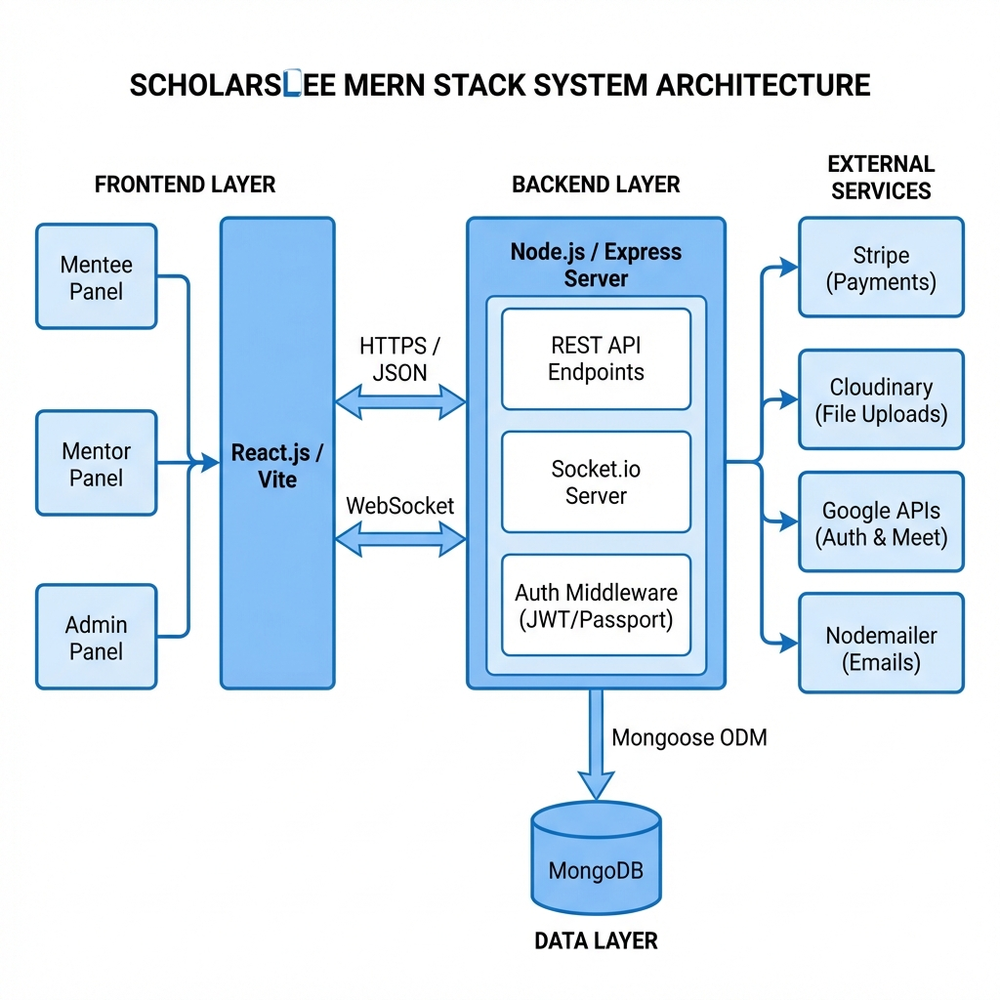
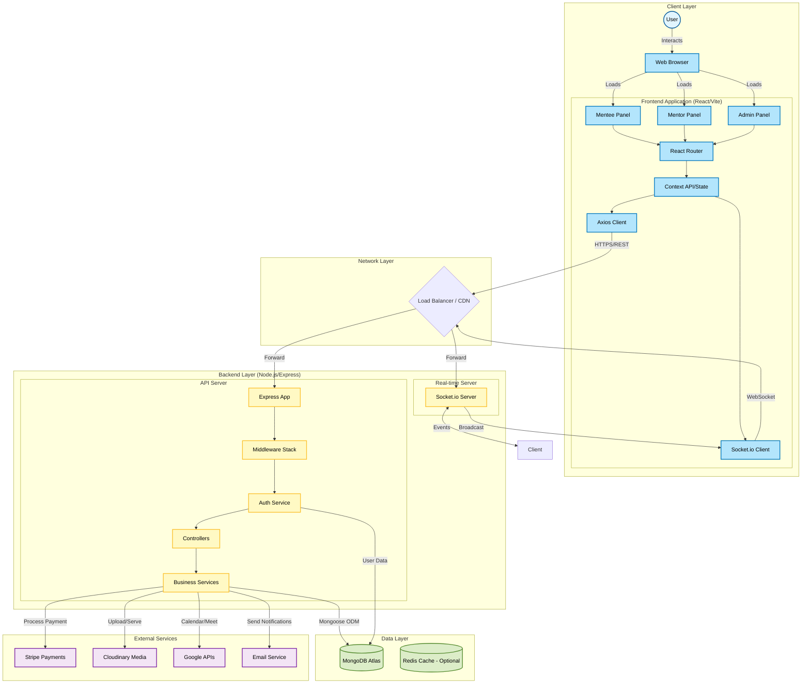

# System Architecture Diagram

## Mermaid Source Code (Reference)

## Data Flow Description

### 1. User Interaction
- Users interact with one of three panels: **Mentee**, **Mentor**, or **Admin**.
- **React Router** handles client-side navigation.
- **Context API** manages global state (User, Auth, Notifications).

### 2. Network Communication
- **Axios** sends secure HTTPS REST requests for data operations.
- **Socket.io Client** establishes a persistent WebSocket connection for real-time features.
- Traffic passes through the network layer (CDN/Load Balancer) to the backend.

### 3. Backend Processing
- **Express Server** receives HTTP requests passing them through the **Middleware Stack** (CORS, Helium, Auth).
- **Controllers** handle request logic and validation.
- **Services** encapsulate business logic and communicate with external APIs and the database.
- **Socket.io Server** handles real-time events (Chat, Notifications) and broadcasts updates.

### 4. Data Persistence
- **MongoDB Atlas** stores all persistent data using **Mongoose** schemas.
- Collections include Users, Profiles, Bookings, Services, Messages, etc.

### 5. Third-Party Integrations
- **Stripe**: Handles secure payment processing and payouts.
- **Cloudinary**: Manages image and file uploads/delivery.
- **Google APIs**: Manages Login, Calendar events, and Meet links.
- **Notification Services**: Sends transactional emails and alerts.
